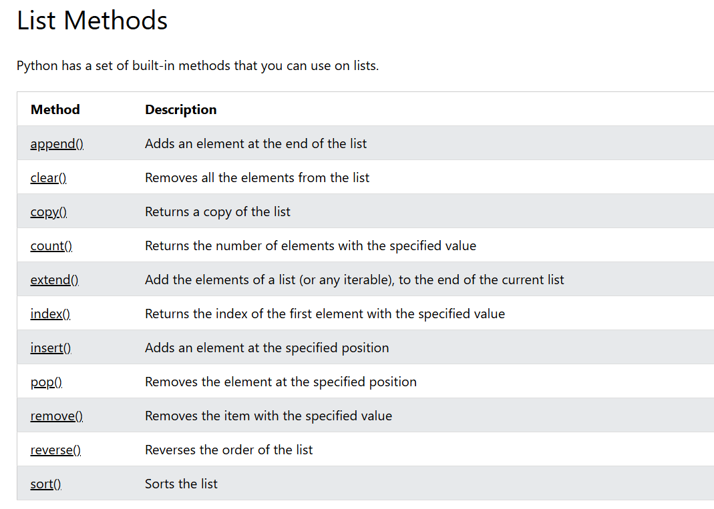
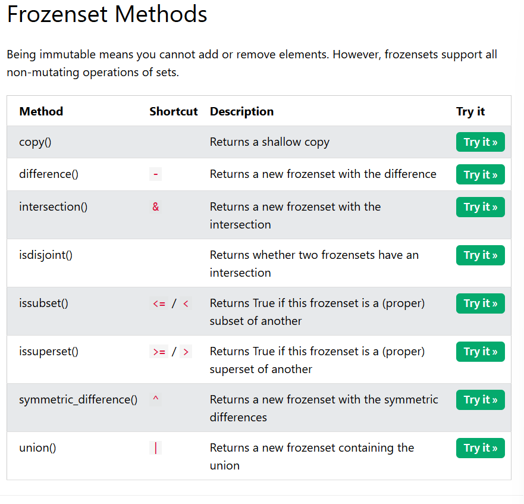
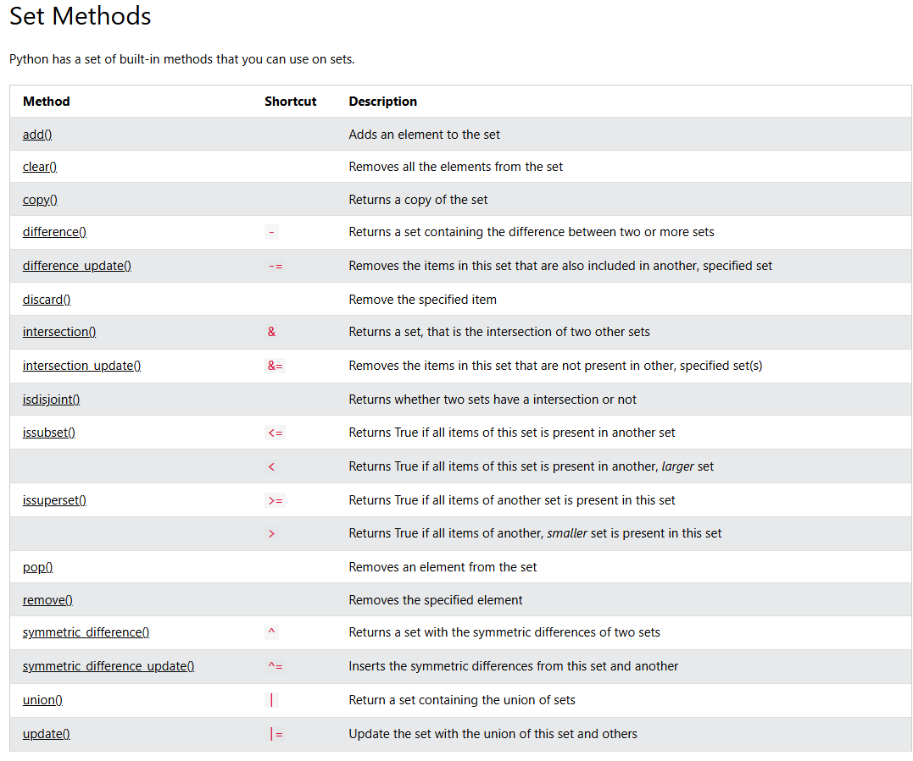
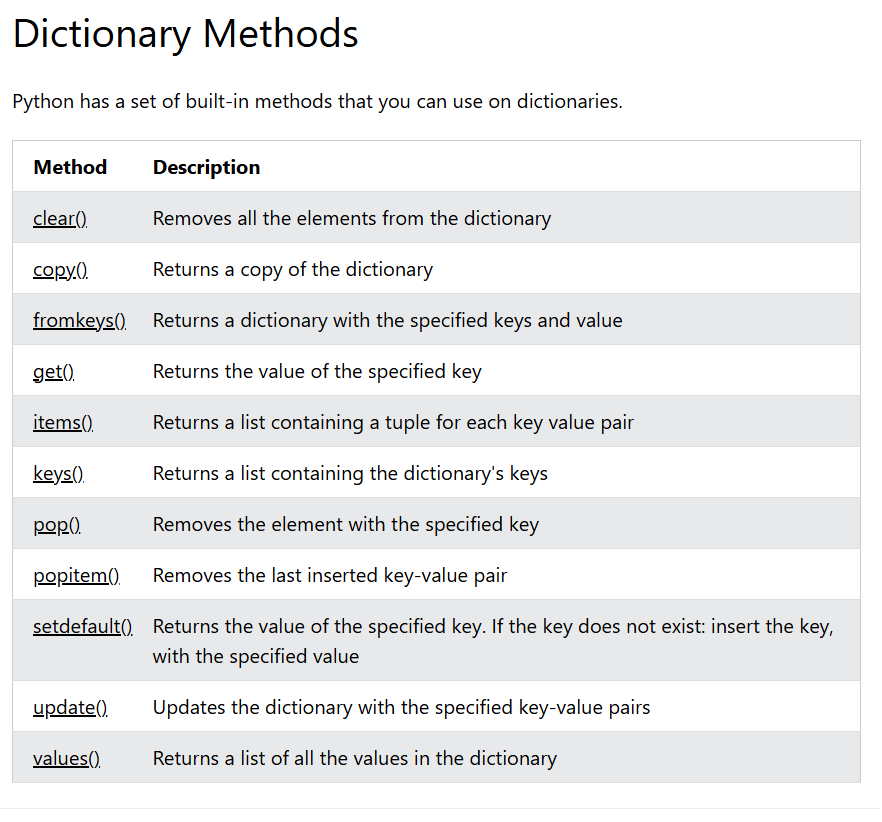

# WEEK 1 DAY 2

## Variables

- Global Variables
- Local Variables

## Data Types
Python has the following built-in data types:

- Text Type: `str`
- Numeric Types: `int`, `float`, `complex`
- Sequence Types: `list`, `tuple`, `range`
- Mapping Type: `dict`
- Set Types: `set`, `frozenset`
- Boolean Type: `bool`
- Binary Types: `bytes`, `bytearray`, `memoryview`
- None Type: `NoneType`

## Data Types Diagram

## Strings
- Strings are Arrays - `a = "Hello, World!" print(a[1]) output = H`

## String Methods

# WEEK 1 DAY 3

## Python collections(Data types)
There are four collections of datatypes in the python programming language:
- List : `It is a collection which is ordered and changeable which allows duplicate members`
-Tuple : `is a collection which is orderd and unchangeable. Allows duplicate member`
-Set : `It is a collection which is unordered, unchangeable and unindexed. No duplicate members`
.Set items are unchangeable, but you can remove and/or add items whenever you like.
-Dictionary : `It is a collection which is ordered and changeable. No duplicate members`
.As of Python version 3.7, dictionaries are ordered. In Python 3.6 and earlier, dictionaries are unordered.

## List Methods

## FROZEN SET METHODS

## Set Methods

## Dictionary methods
