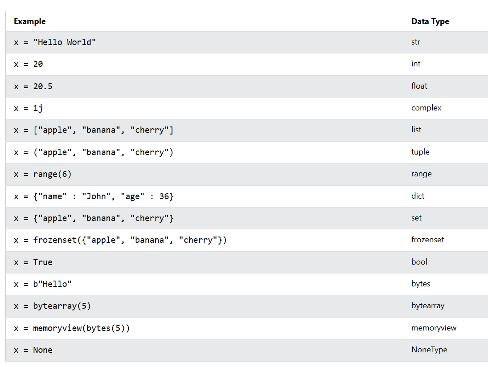
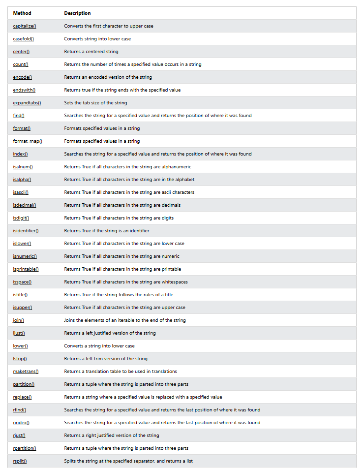
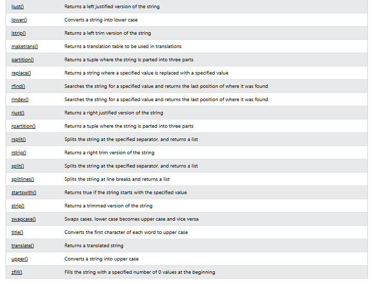

# WEEK 1 DAY 2

## Variables

- Global Variables
- Local Variables

## Data Types
Python has the following built-in data types:

- Text Type: `str`
- Numeric Types: `int`, `float`, `complex`
- Sequence Types: `list`, `tuple`, `range`
- Mapping Type: `dict`
- Set Types: `set`, `frozenset`
- Boolean Type: `bool`
- Binary Types: `bytes`, `bytearray`, `memoryview`
- None Type: `NoneType`

## Data Types Diagram

## Strings
- Strings are Arrays - `a = "Hello, World!" print(a[1]) output = H`

## String Methods

